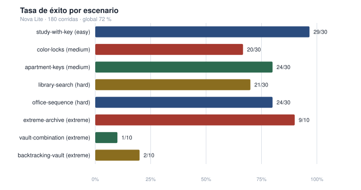
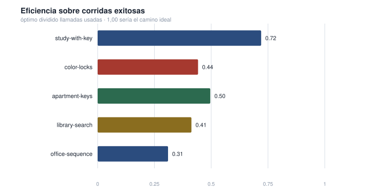
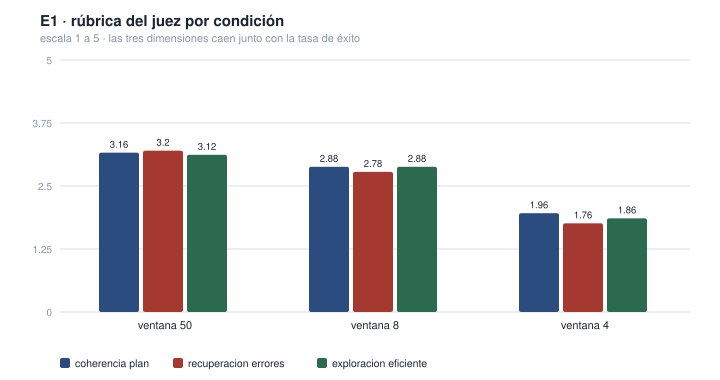
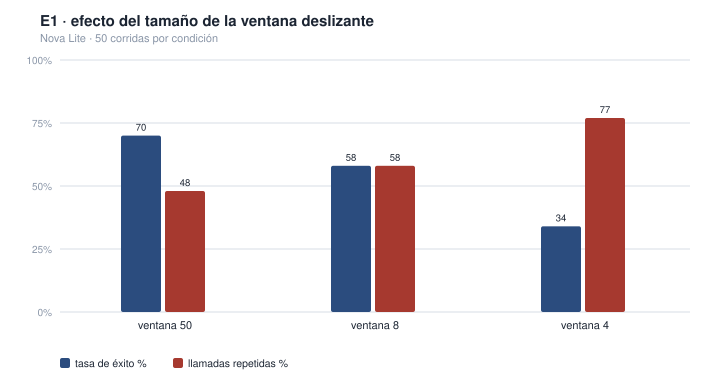
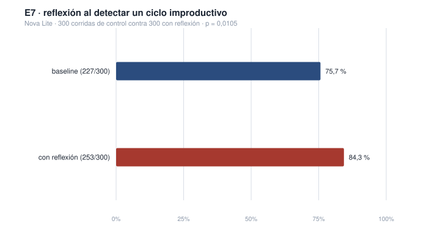

# Trabajo Práctico Final — Escape Room Agent

**Agentes Autónomos y Sistemas de Decisión**

HOFMANN · PIVOTTO · KARAGOZIAN

Universidad de San Andrés — Maestría en Inteligencia Artificial

Buenos Aires, Agosto de 2026

---

## Resumen ejecutivo

Este trabajo evalúa un agente ReAct construido desde cero a lo largo de tres
milestones, resolviendo ocho escenarios de escape room mediante herramientas de
mundo. La medición central son **180 corridas** con `amazon.nova-lite-v1:0`
sobre Amazon Bedrock, y sobre ellas se apoyan **nueve experimentos** de ablación
que suman más de 1.400 corridas del agente en total.

**Resultado.** El agente resuelve **130 de 180 escenarios (72 %, intervalo de
confianza al 95 % de 65 a 78)**. Sobre los cinco escenarios obligatorios hasta
dificultad hard, **118 de 150 (78,7 %, de 71 a 84)**. Ningún escenario alcanza
el 100 %: medido como pass^k, ninguno es perfectamente confiable.

**Hallazgo principal.** La elección del modelo domina sobre toda decisión de
diseño del framework. Cambiar de llama3.1 8B a Nova Lite, **sin tocar una sola
línea de código**, movió la tasa de éxito de 25 % a 70 % sobre las condiciones
comparables: un salto de 45 puntos que ninguna intervención de framework se
acerca a igualar.

**El framework no está agotado, pero hay que medir dónde intervenir.** De ocho
intervenciones probadas, una mejoró el resultado, dos lo empeoraron y cinco no
lo movieron. La que funcionó fue **E7**, que interrumpe al agente cuando entra
en un ciclo improductivo y le pide replantear: **75,7 % → 84,3 %, p = 0,0105**,
con 300 corridas por rama y la ampliación registrada de antemano.

Lo relevante es cómo se llegó. **E5 había probado la misma idea y empeoró el
resultado**, de 80 % a 70 %. La diferencia no está en la idea sino en el
disparador: E5 frenaba al agente apenas repetía una acción, y medir las trazas
mostró que repetir es lo que hacen también las corridas sanas —el 78 % repite
alguna acción, y el 65 % de las que empiezan a repetir igual llegan a la meta—.
Recalibrado el disparador contra 180 trazas ya guardadas, la misma idea
funciona. El experimento que sirvió es el que se diseñó con datos.

**Corolario metodológico.** Las conclusiones de un experimento de ablación no
transfieren entre modelos. E1 y E2 se corrieron completos sobre las dos
campañas y dieron resultados distintos, en un caso directamente opuestos: la
intervención que ayudaba a llama3.1 es la que perjudica a Nova Lite.

**Modo de fallo.** Con Nova Lite desaparecen por completo los fallos de
disciplina de tool calling que dominaban con el modelo chico. Los cincuenta
fracasos restantes son, sin excepción, **bucle**: el agente repite acciones ya
ejecutadas hasta agotar el presupuesto de iteraciones. E7 lo mitiga pero no lo
elimina; el 16 % de fracasos que sobrevive sigue siendo bucle.

**Qué no se puede afirmar.** El juez LLM no está calibrado contra anotación
humana, así que sus tres dimensiones de conducta valen como señal comparativa
entre condiciones y no como medición absoluta —y hay evidencia de que ni
siquiera son tres dimensiones: correlacionan entre sí más de lo que correlacionan
con el resultado, que es el patrón del efecto halo—. Los tres escenarios extreme
tienen 10 corridas cada uno, muy pocas para sostener comparaciones finas entre
ellos. No se pudo evaluar un tercer modelo, bloqueado por permisos de la cuenta
de AWS y no por decisión de diseño.

## Índice

- [0. Marco teórico — Arquitectura del agente](#0-marco-teórico--arquitectura-del-agente)
  - [El tool use como protocolo](#el-tool-use-como-protocolo)
  - [Gestión de contexto](#gestión-de-contexto)
  - [Condiciones de parada y errores como observaciones](#condiciones-de-parada-y-errores-como-observaciones)
- [1. Aproximación](#1-aproximación)
- [2. Evals](#2-evals)
  - [2.1. Dimensiones de calidad](#21-dimensiones-de-calidad)
  - [2.2. Dónde se observa cada dimensión](#22-dónde-se-observa-cada-dimensión)
  - [2.3. Quién juzga cada dimensión](#23-quién-juzga-cada-dimensión)
  - [2.4. Modos de fallo](#24-modos-de-fallo)
  - [2.5. Meta evaluación del juez (faltante)](#25-meta-evaluación-del-juez-faltante)
- [3. Resultados](#3-resultados)
  - [3.1. Por qué se mide con repeticiones y no con una corrida](#31-por-qué-se-mide-con-repeticiones-y-no-con-una-corrida)
  - [3.2. Metodología de medición](#32-metodología-de-medición)
  - [3.3. Tasa de éxito por escenario](#33-tasa-de-éxito-por-escenario)
  - [3.4. El modelo domina sobre las decisiones de framework](#34-el-modelo-domina-sobre-las-decisiones-de-framework)
  - [3.5. Eficiencia](#35-eficiencia)
  - [3.6. Dimensiones de conducta según el juez](#36-dimensiones-de-conducta-según-el-juez)
  - [3.7. Capacidad contra confiabilidad: pass@k y pass^k](#37-capacidad-contra-confiabilidad-passk-y-passk)
- [4. Experimentos](#4-experimentos)
  - [E1. Presupuesto de memoria conversacional](#e1-presupuesto-de-memoria-conversacional)
  - [E2. Prompt genérico contra prompt especializado](#e2-prompt-genérico-contra-prompt-especializado)
  - [E3. Memoria episódica de acciones ejecutadas](#e3-memoria-episódica-de-acciones-ejecutadas)
  - [E4. Presupuesto de iteraciones](#e4-presupuesto-de-iteraciones)
  - [E5. Bloqueo de repeticiones estériles](#e5-bloqueo-de-repeticiones-estériles)
  - [E6. Planificador explícito de sub-objetivos](#e6-planificador-explícito-de-sub-objetivos)
  - [E7. Reflexión ante un ciclo detectado](#e7-reflexión-ante-un-ciclo-detectado)
  - [E8. Temperatura del modelo](#e8-temperatura-del-modelo)
  - [E9. Herramientas distractoras](#e9-herramientas-distractoras)
  - [Lectura conjunta de los nueve experimentos](#lectura-conjunta-de-los-nueve-experimentos)
- [5. Limitaciones y próximos pasos](#5-limitaciones-y-próximos-pasos)
- [Reproducibilidad](#reproducibilidad)

---

## 0. Marco teórico — Arquitectura del agente

El framework construido a lo largo de M1 y M2 sigue el paradigma ReAct que
intercala razonamiento y acción en un mismo bucle en lugar de separarlos en
etapas independientes de planificación y ejecución. En cada turno el agente
atraviesa el ciclo genérico de percepción, actualización de estado, decisión y
acción que se vio en la materia como el estilo arquitectónico común a cualquier
agente, desde un termostato hasta un sistema con un modelo de lenguaje. En este
framework, sense es la observación que llega como resultado de la última
herramienta invocada, state es el historial acumulado en la conversación, decide
es la llamada al modelo con ese historial y los esquemas de herramientas
disponibles, y act es la ejecución real de la herramienta elegida, que nunca
corre dentro del modelo sino en el runtime que lo rodea. El framework no
implementa una etapa explícita de reflect, lo cual es consistente con lo visto
en clase, ReAct en su forma original tampoco la incluye, esa etapa aparece
recién en arquitecturas posteriores.

Esta forma de operar encaja con el problema de M3 de un modo particular. Una
sala de escape es un entorno parcialmente observable, el agente no tiene acceso
directo al estado completo del mundo, solo puede reconstruirlo invocando
herramientas. Un objeto guardado dentro de un cofre no existe para el agente
hasta que un `examine` lo revela, y una sala contigua no forma parte de su
representación del mundo hasta que un `go` lo lleva ahí. El agente debe
sostener, turno a turno, un modelo interno del entorno construido únicamente a
partir de lo que sus propias acciones le devuelven, exactamente el problema que
la clase describe como memoria de trabajo operando sobre un entorno que no se
revela de una sola vez.

El sistema tiene cuatro componentes con responsabilidades separadas.

| Componente | Responsabilidad | Ubicación |
| :---- | :---- | :---- |
| **Cliente del LLM** | Abstrae el proveedor concreto detrás de un único método `chat`, que recibe mensajes, herramientas disponibles y system prompt. Es el contrato de API descripto en la materia, messages, system, tools y la respuesta con su contenido y sus tool calls. | `mia_agents/llm_client.py` (fijo) |
| **Registro de herramientas** | Cada herramienta es una función pura de Python que devuelve un string, acompañada de un esquema JSON derivado automáticamente de su firma y su docstring. El docstring se convierte en la descripción que el modelo lee para decidir cuándo usar la herramienta, el mismo mecanismo que la materia señala como el factor que más afecta la performance del tool use. | `agent.register_tool` |
| **Bucle del agente** | Llama al modelo, y si la respuesta trae una o más invocaciones de herramientas las ejecuta y devuelve cada resultado como observación nueva. Si la respuesta es texto sin invocaciones, ese texto es la respuesta final. El número de iteraciones está acotado. | `student_framework/agent.py`, método `run` |
| **Memoria conversacional** | El historial se conserva entre llamadas sucesivas, de modo que la tarea se extiende a lo largo de muchos turnos sin perder contexto previo. | `MyAgent`, atributo `_history` |

### El tool use como protocolo

El uso de herramientas sigue exactamente el protocolo de dos turnos visto en la
materia. En el primer turno el modelo no ejecuta nada, emite una invocación
estructurada con el nombre de la herramienta y sus argumentos. El runtime
intercepta esa invocación, valida los argumentos contra el esquema registrado y
ejecuta la función real. En el segundo turno el resultado vuelve al modelo como
una observación, y recién ahí el modelo continúa. Este protocolo, repetido
muchas veces, es el agent loop. La separación de responsabilidades es estricta,
el modelo decide qué herramienta usar, el código la ejecuta, y esa separación es
la que permite que un error de herramienta se trate como una observación más y
no como un fallo que interrumpe la ejecución, un punto que retoma la sección 1
al describir un bug real del framework.

### Gestión de contexto

La materia describe cuatro estrategias para administrar una ventana de contexto
que crece sin límite, truncado simple, ventana deslizante, resumen y
almacenamiento externo con recuperación bajo demanda. El framework de M2 eligió
la segunda, una ventana deslizante con anclaje, por dos razones que coinciden
con las discutidas en clase. Resumir exige una llamada adicional al modelo por
cada recorte, lo que suma costo y latencia, y además introduce una compresión
con pérdida, un resumen puede omitir justo el detalle que la tarea necesita más
adelante, y si se resume varias veces puede aparecer lo que la materia llama
summary drift, una deformación progresiva de lo que realmente ocurrió.
Recuperar información desde un almacenamiento externo es la estrategia más
cercana a una memoria de largo plazo genuina, pero exige infraestructura
adicional que el problema de M3 no requiere, porque el estado relevante de la
tarea entra completo en una ventana razonable de mensajes.

La ventana deslizante con anclaje que implementa el framework preserva en cada
llamada el último mensaje del usuario, un mensaje ancla con el objetivo original
de la tarea, y la coherencia estructural entre una invocación de herramienta y
su resultado. La decisión de anclar el objetivo al principio de la ventana, en
lugar de dejar que se pierda en un recorte simple, también encuentra respaldo en
el fenómeno de lost in the middle, que muestra que un modelo recupera mejor la
información ubicada al principio o al final del contexto que la que queda en el
medio, así que mantener el objetivo fijo en un extremo de la ventana no es
arbitrario. El experimento E1, en la sección 4, mide exactamente el costo de
esta estrategia frente a la alternativa de recortarla más agresivamente.

### Condiciones de parada y errores como observaciones

La materia enumera cinco condiciones de parada canónicas para un agent loop,
meta alcanzada, límite de iteraciones, presupuesto de costo, deadlock por
repetición, y cascada de errores de herramienta. El framework implementa las
primeras tres de forma directa, el cierre por texto sin tool calls, el tope de
`max_iterations`, y el seguimiento de tokens de entrada y salida en cada
`AgentResult`. La cuarta, deadlock por repetición, no está implementada como
condición de parada en el bucle base, y esa ausencia resultó ser precisamente el
modo de fallo dominante en los resultados de la sección 3, y el objeto del
experimento E5 en la sección 4. La quinta, tratar los errores de herramienta
como observación y no como un fallo fatal que interrumpe la ejecución, sí está
presente desde M1, y es la que permitió detectar y corregir el bug de despacho
descripto en la sección 1.

---

## 1. Aproximación

El problema que resuelve este milestone puede plantearse así. El framework de M1
y M2 se diseñó y se validó exclusivamente contra herramientas de propósito
general, una calculadora y un lector de archivos, sin ninguna noción de un
dominio particular. La pregunta que abre M3 es si ese mismo núcleo, sin
modificaciones, puede resolver un problema completamente distinto, una sala de
escape con un conjunto de herramientas ajeno, usando únicamente la superficie de
configuración que el framework ya exponía, tools, system prompt, presupuesto de
iteraciones y tamaño de ventana. El bucle del agente no se tocó en ningún
momento del proceso.

El mundo simulado y los escenarios son provistos por los profesores y se
consideran fijos. La sala de escape se resuelve con cuatro verbos genéricos,
`look`, `examine`, `take` y `use`, más un quinto verbo, `go`, que aparece solo en
los escenarios de varias salas. La conexión con el framework reutiliza el mismo
patrón de registro que ya existía desde M1.

```python
escenario = load_scenario(path)
mundo     = escenario.initial_world
agente    = build_agent(config)

for fn, schema in make_world_tools(mundo):
    agente.register_tool(fn, schema)

resultado      = agente.run(escenario.user_message)
logrado, razon = check_goal(mundo, escenario.goal)
```

Las herramientas del mundo llegan ya empaquetadas como pares de función y
esquema, exactamente la forma que `register_tool` esperaba desde el primer
milestone. No hizo falta adaptar nada del bucle para que hablara con este
dominio nuevo, la especialización ocurrió en tres decisiones de configuración.

* **Un system prompt específico del dominio.** El prompt por defecto del
  framework producía una conducta indeseada, el modelo describía la sala con un
  `look` y luego le preguntaba al usuario qué hacer. Como la condición de cierre
  del bucle es texto sin invocaciones de herramientas, esa pregunta terminaba la
  corrida de inmediato, con la puerta todavía cerrada. El prompt especializado
  fija el objetivo, describe el ciclo de observar, explorar, tomar y usar, y
  exige una acción por turno, siguiendo la estructura de secciones para un system
  prompt que se vio en clase, identidad, capacidades, restricciones, formato de
  salida y manejo de casos borde. Conviene anticipar acá un resultado que el
  experimento E2 documenta en detalle: esta especialización fue decisiva con
  llama3.1 e irrelevante con Nova Lite, donde el prompt genérico obtiene
  exactamente la misma tasa de éxito. La conducta de asistente conversacional que
  el prompt corregía era un defecto del modelo chico, no una carencia del
  framework.

* **Un presupuesto de iteraciones ajustado al tamaño del problema.** El valor por
  defecto del framework, diez iteraciones, resultaba insuficiente para escenarios
  cuya solución óptima ya requiere más de diez llamadas. Con ese límite, buena
  parte del desglose de errores habría medido el techo impuesto por la
  configuración en lugar del comportamiento real del modelo.

* **La desactivación de las herramientas propias de M1 y M2.** La calculadora y
  el lector de archivos no tienen ningún rol en una sala de escape, ofrecerlas
  solo agrega opciones de distracción y consume tokens en cada llamada sin
  aportar nada a la tarea.

Durante las primeras corridas contra un modelo real apareció un problema que
ningún test con el cliente simulado había detectado. El agente entraba en un
ciclo repitiendo `examine` sin avanzar. La causa no estaba en el modelo sino en
el manejo de errores del propio framework. El modelo invocaba `examine` con el
argumento `objeto` en lugar de `target`, el nombre real del parámetro, y el
despacho de herramientas devolvía la excepción cruda de Python, un mensaje que no
indicaba cuál era el nombre correcto. Esto contradice directamente el principio
de tratar los errores como observaciones útiles para que el agente corrija su
siguiente paso, que la materia distingue de un crash fatal, un error mal
formulado es tan inútil para el modelo como no tener error en absoluto. La
corrección validó los argumentos contra el esquema registrado antes de invocar la
función, devolviendo un mensaje que sugiere explícitamente el nombre correcto. El
efecto fue inmediato, en la misma corrida el modelo se equivocó dos veces de
nombre y se corrigió las dos, resolviendo el escenario en ocho pasos donde antes
fallaba después de catorce.

El punto que vale la pena subrayar no es la corrección en sí, sino que
la suite entera con el cliente simulado había pasado, antes y después, sin
detectar el problema (doscientos diez tests en ese momento, doscientos noventa
y dos en la entrega final), porque ese cliente nunca se equivoca de nombre de
argumento. Solo un modelo real produce ese tipo de error, y por eso una
evaluación de agentes que se apoya únicamente en mocks tiene un punto ciego
estructural.

---

## 2. Evals

La materia propone descomponer la evaluación de un agente en un conjunto de
preguntas sucesivas, qué significa que funcione, dónde se observa esa calidad,
cómo se convierte lo observado en un número, quién emite el juicio, y sobre qué
casos se mide. Esta sección sigue esa misma estructura, porque separar esas
preguntas es lo que evita confundir instrumentos que miden cosas distintas.

### 2.1. Dimensiones de calidad

| Dimensión de calidad | Qué mide |
| :---- | :---- |
| Correctitud | ¿Llegó a la meta? Estado del mundo, no texto del agente. |
| Eficiencia | ¿Cuántas llamadas usó contra el óptimo conocido? |
| Coherencia del plan | ¿Las acciones se relacionan con el objetivo? |
| Recuperación ante errores | ¿Corrige después de un error, o repite? |
| Eficiencia de la exploración | ¿Cada acción aporta información nueva, o repite lo ya hecho? |

Las dos primeras son propiedades del resultado y del costo. Las tres últimas son
propiedades de la conducta, y sólo tienen sentido mirando el camino completo, no
el desenlace.

Correctitud se calcula con `check_goal`, que inspecciona el estado interno del
mundo, por ejemplo si la puerta principal quedó abierta, y no el texto que el
agente produce. En varias corridas el agente afirmó haber abierto la puerta
cuando el estado del mundo indicaba lo contrario. Medir sobre el estado del mundo
es la aplicación directa de la regla de diseño vista en clase, llevar todo lo que
se pueda hacia verificación determinística y reservar el juicio de un modelo para
lo que realmente requiere interpretación.

Eficiencia es el cociente entre el número óptimo de llamadas del escenario y las
que efectivamente usó el agente, acotado a uno y calculado sólo sobre corridas
exitosas, para no premiar el abandono temprano de una corrida fallida como si
fuera eficiencia.

### 2.2. Dónde se observa cada dimensión

| Dimensión de calidad | Dónde se observa |
| :---- | :---- |
| Correctitud | Output. Estado final del mundo (`check_goal`). |
| Eficiencia | Trace. Cuenta de pasos de la traza completa. |
| Coherencia, recuperación, exploración | Trace. Requieren ver la secuencia de acciones, no solo el resultado. |

Correctitud se lee del estado final, sin necesidad de la traza completa. Las
otras cuatro exigen ver la secuencia de acciones paso a paso.

### 2.3. Quién juzga cada dimensión

| Dimensión de calidad | Judge | Por qué |
| :---- | :---- | :---- |
| Correctitud | Código (`check_goal`) | Verificación objetiva y determinística. Abrir o no una puerta no requiere interpretación. |
| Eficiencia | Código (cálculo aritmético) | Óptimo dividido llamadas usadas. Tampoco requiere interpretación. |
| Coherencia, recuperación, exploración | LLM judge | Requieren juicio sobre la conducta, no una verificación exacta. |

El LLM judge puntúa de forma pointwise, recibe una única traza y la puntúa contra
la rúbrica, sin compararla con otra traza (no se usó pairwise, queda anotado en
la sección 5). Recibe un resumen compacto, con el escenario, si la meta fue
alcanzada, óptimo contra llamadas usadas, y la secuencia de acciones con su
desenlace, acotada a cuarenta pasos. Su system prompt, tal como aparece en el
código:

> *"Sos un evaluador de agentes autónomos. Recibís la traza de un agente que
> intentó resolver una sala de escape y la puntuás con la rúbrica indicada. Sé
> estricto y objetivo, puntuás la conducta observable, no el resultado. Un agente
> puede fallar y aun así haber explorado con criterio, y puede acertar habiendo
> dado muchas vueltas."*

Conviene señalar una tensión que la propia implementación introduce, el resumen
que recibe el juez incluye si la meta fue alcanzada antes de que puntúe, lo que
abre la puerta a que el juicio quede correlacionado con el desenlace aunque se le
pida lo contrario. En la campaña con llama3.1 se observó ese efecto (sección 5).

La salida se obtiene mediante `structured_call`, la tool sintética
`final_result` de M2, en vez de pedir prosa y parsear con regex. Es la evidencia
más clara de que el mecanismo de M2 funciona sobre un problema real.

La rúbrica usa escala ordinal de uno a cinco para las tres dimensiones de
conducta, no binaria. La materia recomienda binario por defecto y reserva las
escalas ordinales para cuando existe una gradación legítima, con cada nivel
definido, el caso de coherencia y exploración.

| Dimensión de calidad | Ancla en 1 | Ancla en 5 |
| :---- | :---- | :---- |
| **Coherencia del plan** | Las acciones no guardan relación con el objetivo. | El plan es claro y progresa hacia la meta. |
| **Recuperación ante errores** | El agente repite la acción que falló sin cambiar nada. | El agente lee el error y corrige su siguiente acción. |
| **Eficiencia de la exploración** | El agente repite acciones que ya había hecho. | Cada acción nueva aporta información distinta. |

### 2.4. Modos de fallo

Cuando correctitud falla (la corrida no llegó a la meta), conviene saber por qué.
Eso es error analysis, y acá está automatizado con una taxonomía de código sobre
la traza, en vez del proceso manual de observar cada traza, describirla en una
oración, y agrupar. La automatización gana escala sobre cientos de corridas, pero
pierde la posibilidad de encontrar un modo de fallo que ninguna regla anticipó.

Los modos, en orden de prioridad para el caso de una corrida que exhiba varios a
la vez:

* **Llamada escrita como texto.** El modelo redacta la invocación como texto
  plano en vez de emitirla por tool calling, el bucle la lee como respuesta final
  y cierra.
* **Orden incorrecto.** La meta exige una secuencia de sub-objetivos y no se
  respetó.
* **Desborde de contexto.** Algún prompt se acercó al techo de la ventana.
* **Bucle.** Una fracción relevante de las llamadas repite una combinación ya
  ejecutada. Este modo es, específicamente, el fracaso de la dimensión de
  eficiencia de la exploración, y en el vocabulario de la materia, la ausencia de
  una condición de parada por deadlock.
* **Acción inválida.** La herramienta corrió sin excepción pero el mundo la
  rechazó.
* **Argumentos inválidos.** JSON mal formado o nombres de parámetro que no
  coinciden con el esquema.
* **Herramienta inexistente.** Nombre no registrado.
* **Límite de iteraciones.** Se agotó el tope configurado.
* **Parada prematura.** Cerró con texto sin cumplir la meta, sin que ninguna
  categoría anterior lo explique.

Una corrida exitosa no recibe ninguna categoría, aunque haya cometido errores en
el camino, si se recuperó y llegó a la meta, esos errores no cuentan como fallo.

### 2.5. Meta evaluación del juez (faltante)

La materia insiste en que un juez basado en un modelo no debería aceptarse por
default, hay que calibrarlo contra un golden set etiquetado por humanos y medir
el acuerdo con una métrica corregida por azar, como el coeficiente Kappa, antes
de confiar en sus veredictos. Ese paso no se hizo en este proyecto, no existe un
conjunto de trazas con etiquetas humanas contra el cual se haya medido el acuerdo
del juez. Es una limitación real, reconocida en la sección 5, y significa que las
dimensiones de calidad reportadas más abajo deben leerse como señal comparativa
entre condiciones, nunca como una medición calibrada.

El instrumental para hacerlo quedó construido en `eval/calibracion.py`: muestra
estratificada por escenario y desenlace, cuadernillo que le muestra al anotador
**el mismo texto que recibió el juez** y nada más, y kappa de Cohen con pesos
cuadráticos, ponderado porque la rúbrica es ordinal y confundir un 4 con un 5 no
es el mismo error que confundir un 1 con un 5. Lo que falta es el etiquetado
humano, que no se hizo: calibrar contra tres anotadores independientes.

Sí se pudo hacer una comprobación más barata que no necesita anotadores, y el
resultado es incómodo. Sobre las 349 trazas juzgadas, **las tres dimensiones
correlacionan entre sí mucho más de lo que cada una correlaciona con el
desenlace**:

| | Correlación |
| :---- | :---- |
| coherencia de plan ↔ recuperación de errores | r = 0,85 |
| coherencia de plan ↔ exploración eficiente | r = 0,85 |
| recuperación de errores ↔ exploración eficiente | r = 0,74 |
| cada dimensión ↔ éxito de la corrida | r = 0,49 a 0,66 |

Es el patrón característico del **efecto halo**: el juez forma un juicio global
de "esta traza se ve bien" y lo distribuye entre tres casilleros que el schema
presenta como independientes. Cada dimensión discrimina éxito de fracaso
razonablemente bien por separado, con área bajo la curva entre 0,79 y 0,88, pero
tratarlas como tres mediciones distintas sobrestima cuánta información aportan
en conjunto. Una rúbrica que quisiera medir de verdad tres conductas separadas
tendría que forzar esa separación, por ejemplo puntuando cada dimensión en una
llamada distinta, sin ver las otras dos.

---

## 3. Resultados

### 3.1. Por qué se mide con repeticiones y no con una corrida

El sistema es estocástico, el mismo agente, con exactamente la misma
configuración, puede resolver o no resolver el mismo escenario en dos intentos
distintos. Una única corrida es, en términos de la materia, una observación, no
una medición, y reportar el resultado de esa única extracción como si fuera el
desempeño del agente es exactamente la generalización apresurada que se advirtió
en la parte teórica del curso.

La materia distingue además dos preguntas distintas que pueden hacerse sobre un
mismo conjunto de repeticiones. Pass@k pregunta si el agente es capaz de resolver
el problema alguna vez entre k intentos, y tiene sentido cuando el usuario puede
reintentar o elegir entre varias propuestas. Pass^k pregunta si el agente
resuelve el problema de manera consistente en todos los intentos, y es la
pregunta relevante para un agente autónomo que actúa sin supervisión humana en el
momento, exactamente el caso de este problema, nadie corrige al agente mientras
intenta escapar de la sala. Por eso lo que reporta este informe no es si el
agente logró resolver cada escenario alguna vez, sino con qué tasa lo resuelve de
forma consistente.

A esto se suma una segunda razón, propia de la estructura del problema. Cada
escenario es una sala de escape distinta, sin estado compartido ni dependencia
con los demás, son eventos independientes entre sí. Exigir que las cinco tareas
obligatorias se resuelvan dentro de una única secuencia conjunta no aportaría
información adicional sobre la capacidad del agente, mezclaría cinco mediciones
independientes en una sola sin ninguna justificación. Por eso este informe
reporta la tasa de éxito de cada escenario por separado, sobre un número fijo de
repeticiones independientes.

### 3.2. Metodología de medición

| Parámetro | Valor |
| :---- | :---- |
| **Modelo evaluado** | `amazon.nova-lite-v1:0` sobre Amazon Bedrock |
| **Configuración** | Idéntica para los ocho escenarios, mismo prompt de dominio, misma ventana de historial, mismo presupuesto de iteraciones |
| **Repeticiones por escenario** | 30 corridas en los cinco escenarios hasta hard, 10 en los tres extreme |
| **Corridas totales de la campaña** | 180 sobre los ocho escenarios del dataset |
| **Corridas descartadas por fallo de infraestructura** | 0 |

Las corridas descartadas se cuentan aparte y se excluyen de todos los agregados.
Una corrida que se interrumpe por una falla del proveedor tiene sus pasos, tokens
y latencia truncados en un punto arbitrario, así que promediarla junto al resto
ensuciaría cada métrica. Que el contador sea visible obliga a mirar cuántas se
perdieron en lugar de que desaparezcan en silencio.

### 3.3. Tasa de éxito por escenario

| Escenario | Dificultad | Éxito | Intervalo de confianza al 95 % (%) |
| :---- | :---- | :---- | :---- |
| **study with key** | easy | 29 de 30 (97 %) | 83 a 99 |
| **color locks** | medium | 20 de 30 (67 %) | 49 a 81 |
| **apartment keys** | medium | 24 de 30 (80 %) | 63 a 90 |
| **library search** | hard | 21 de 30 (70 %) | 52 a 83 |
| **office sequence** | hard | 24 de 30 (80 %) | 63 a 90 |
| **extreme archive** | extreme | 9 de 10 (90 %) | 60 a 98 |
| **backtracking vault** | extreme | 2 de 10 (20 %) | 6 a 51 |
| **vault combination** | extreme | 1 de 10 (10 %) | 2 a 40 |
| **Total, 180 corridas** | | **130 de 180 (72 %)** | **65 a 78** |



Agrupando por dificultad declarada: easy 97 %, medium 73 %, hard 75 %, extreme 40 %. Los cinco escenarios obligatorios hasta hard suman 118 de 150 (78,7 %, intervalo de 71 a 84); los tres extreme, que la consigna reserva para la competencia, bajan el promedio general a 72 %.

Los intervalos son de Wilson, no la aproximación normal. Con celdas de diez
corridas y proporciones cercanas a los extremos, la aproximación normal
produce límites fuera del rango válido: para una corrida exitosa de diez
daría un límite inferior negativo. Wilson se mantiene dentro de cero y cien
y es el que corresponde a este tamaño de muestra.

Las 150 corridas de los cinco escenarios obligatorios provienen de tres tandas
de 50 hechas en momentos distintos: la campaña dedicada y los brazos de control
de los experimentos E5 y E6. Que dos de las tres sean brazos de control no es un
atajo, porque `BASELINE` es un único objeto de configuración que todos los
experimentos comparten, así que las tres tandas corrieron literalmente el mismo
agente. Sí implica algo que conviene tener presente al leer las dos secciones
juntas: esta medición y los experimentos E5 y E6 **no son evidencia
independiente**, comparten 100 de estas 150 corridas.

Agrupar tandas distintas solo es lícito si son homogéneas, y lo son. Sus tasas
fueron 80 %, 80 % y 76 %, con un estadístico chi cuadrado de homogeneidad de
0,32 sobre dos grados de libertad, muy por debajo del valor crítico de 5,99. La
dispersión entre tandas es la que predice el azar binomial y no una diferencia
de condiciones, que es exactamente la condición que habilita a tratarlas como
una sola muestra de 150. Esas mismas cifras dan además una idea directa de la
varianza del sistema: la misma configuración, medida tres veces con cincuenta
repeticiones cada una, oscila cuatro puntos.

Ningún escenario alcanza el 100 %, es decir, medido como pass^k ningún
escenario es perfectamente confiable. El ordenamiento general acompaña la
dificultad declarada, con una excepción que vale la pena analizar aparte.

**El caso de extreme archive.** Este escenario esconde una llave entre veinte
expedientes con prosa burocrática y está descripto en la consigna como diseñado para no caber en la ventana de contexto de los modelos chicos. Con
Nova Lite se resuelve el 90 % de las veces, por encima de cuatro de los cinco
escenarios obligatorios. La instrumentación explica por qué: los picos de
tokens de entrada de esas corridas van de 15.304 a 16.468, justo alrededor de
los 16.384 que el proveedor local imponía como techo de ventana y que Bedrock
no impone. La dificultad de ese escenario no era una propiedad de la tarea
sino del modelo con el que se lo corriera, y es la confirmación más literal de
la tesis de la sección 3.4.

Los dos escenarios extreme que sí resisten son los de horizonte largo y varias
salas, vault combination con 10 % y backtracking vault con 20 %. Ambos exigen
combinar objetos hallados en salas distintas y volver sobre los pasos, y ambos
fallan exclusivamente por bucle, agotando el presupuesto de cien iteraciones con 98 y 86 pasos medios respectivamente.

### 3.4. El modelo domina sobre las decisiones de framework

Además de la campaña Nova Lite de la sección anterior, se corrió antes una
campaña independiente con la misma configuración del agente sobre llama3.1 de 8B
de parámetros ejecutado en local con Ollama.

Para que la comparación sea entre iguales, todo lo que sigue se calcula sobre la
**misma población en ambas campañas**: el brazo baseline de los experimentos E1
y E2, que es la única configuración que se corrió completa con los dos modelos.
Son 32 corridas con llama3.1 y 100 con Nova Lite.

| | llama3.1 8B | Nova Lite |
| :---- | ----: | ----: |
| **Tasa de éxito** | 8 de 32 (25 %) | 70 de 100 (70 %) |
| Bucle, repite acciones ya ejecutadas | 46 % de los fracasos | 100 % |
| Llamada escrita como texto | 33 % | 0 % |
| Otros modos combinados | 21 % | 0 % |

El cambio de modelo, por sí solo, movió la tasa de éxito de 25 % a 70 % sin
modificar una sola línea del framework. Es un efecto mayor que el de todas las
intervenciones de framework de la sección siguiente juntas: la única que resultó
positiva, E7, aporta 8,7 puntos contra los 45 del cambio de modelo. (La campaña
completa de Nova Lite, con la configuración final y los ocho escenarios, llega
al 72 % que reporta la sección 3.3; el 70 % de esta tabla corresponde solo a las
condiciones que admiten comparación directa con llama3.1.)

Con Nova Lite desaparecen por completo los modos de fallo asociados a una
disciplina débil de tool calling, y el único modo que persiste es el bucle, la
ausencia de una condición de parada por deadlock que la materia lista entre las
cinco canónicas. Sobre la campaña completa de Nova Lite, que incluye los
escenarios extreme, los cincuenta fracasos se clasifican como bucle sin una
sola excepción.

Una versión anterior de este análisis atribuía un 3 % de los fracasos a desborde
de contexto, y vale la pena explicar por qué se corrigió. El umbral de desborde
del clasificador estaba fijo en 16.384 tokens, que es el `num_ctx` que el
framework le pasa a Ollama, y se aplicaba por igual a las corridas de Bedrock.
Nova Lite admite 300.000 tokens de entrada, de modo que un prompt de dieciséis
mil no lo acerca ni remotamente a su límite: esas corridas no desbordaban nada,
se las estaba midiendo contra el techo de otro proveedor. El umbral ahora
depende del modelo que produjo la traza y ninguna corrida de Nova lo alcanza. El
error era una instancia de la tesis de esta misma sección, una propiedad del
modelo escrita en el código como si fuera una constante del problema.

El cambio de modelo no solo mueve el número agregado, cambia qué conclusiones se
obtienen de los experimentos. Los experimentos E1 y E2 se corrieron completos
sobre ambas campañas y arrojan resultados distintos en cada una, en un caso
opuestos. Esa es la advertencia metodológica más importante de este trabajo, y se
desarrolla en la sección 4: **las conclusiones de un experimento de ablación
sobre un agente no transfieren automáticamente entre modelos.**

### 3.5. Eficiencia

La tasa de éxito responde si el agente llega. La eficiencia responde a qué costo.

| Escenario | Óptimo | Pasos medios (éxitos) | Eficiencia | Tokens de entrada | Latencia mediana |
| :---- | ----: | ----: | ----: | ----: | ----: |
| **study with key** | 3 | 4,7 | 0,67 | 22.701 | 4,4 s |
| **color locks** | 11 | 23,6 | 0,49 | 192.023 | 24,1 s |
| **apartment keys** | 7 | 14,5 | 0,50 | 114.190 | 12,8 s |
| **library search** | 7 | 17,0 | 0,42 | 276.068 | 15,4 s |
| **office sequence** | 13 | 77,2 | **0,27** | 318.242 | 87,9 s |
| **extreme archive** | 4 | 31,5 | **0,17** | — | — |
| **backtracking vault** | 18 | 85,6 | 0,64 | — | — |
| **vault combination** | 21 | 97,8 | 0,78 | — | — |
| **Global, cinco obligatorios** | | | **0,48** | | |



La eficiencia decrece de forma monótona con la dificultad declarada del
escenario, y el caso extremo es office sequence: figura entre los mejores por
tasa de éxito (80 %) y es con diferencia el peor por eficiencia, resuelve usando
casi seis veces el camino óptimo, con una latencia mediana de 88 segundos frente
a los 4 segundos del escenario más simple.

Ese contraste es la justificación empírica de haber definido dos métricas
cuantitativas en lugar de una. Medido solo por correctitud, office sequence y
apartment keys son indistinguibles, ambos al 80 %. Medido también por eficiencia,
uno resuelve cerca del camino ideal y el otro da vueltas hasta casi agotar el
presupuesto.

Extreme archive vuelve a ser el caso instructivo, ahora por el otro extremo:
es el escenario con mejor tasa de éxito después del más simple, y a la vez el
de peor eficiencia de las ocho, 0,17. Su solución óptima son cuatro llamadas y
el agente usa treinta y uno. Resuelve examinando expedientes por fuerza bruta
hasta dar con el correcto, no razonando sobre cuál examinar. Medido solo por
correctitud parecería uno de los escenarios mejor resueltos del conjunto;
medido también por eficiencia queda claro que llega sin haber entendido el
problema.

Las eficiencias altas de vault combination y backtracking vault, 0,78 y 0,64,
se calculan sobre una y dos corridas exitosas respectivamente, así que no
admiten lectura, se reportan por completitud.

La latencia se reporta por mediana y no por media. Durante la campaña una corrida
quedó registrada en 6.207 segundos, frente a una mediana de 12, porque la máquina
estuvo inactiva mientras la evaluación corría desatendida. Esa única observación
multiplicaba por treinta la media de su condición sin que nada en el resultado lo
delatara.

### 3.6. Dimensiones de conducta según el juez

Las tres dimensiones de conducta definidas en la sección 2.1 se midieron sobre
las cincuenta corridas del baseline de la campaña Nova Lite. Las cincuenta
produjeron un veredicto válido, sin un solo fallo de formato, lo que constituye
además la evidencia más directa de que el mecanismo de salida estructurada de M2,
la tool sintética `final_result` con validación y reparación, funciona de forma
confiable sobre un problema real.

| Grupo | Coherencia del plan | Recuperación ante errores | Eficiencia de la exploración | n |
| :---- | ----: | ----: | ----: | ----: |
| Todas las corridas | 3,40 | 3,38 | 3,30 | 50 |
| Corridas que lograron la meta | 3,75 | 3,80 | 3,52 | 40 |
| Corridas que fallaron | 2,00 | 1,70 | 2,40 | 10 |

El juez discrimina con claridad entre corridas exitosas y fallidas en las tres
dimensiones, y la separación es más pronunciada en recuperación ante errores, de
3,80 a 1,70. Eso es coherente con el modo de fallo dominante que reporta la
sección 3.4: una corrida que entra en bucle es, por definición, una corrida que
no se recupera.



Las corridas exitosas obtienen 3,52 en eficiencia de la exploración, la nota más
baja de las tres dimensiones dentro de ese grupo. El agente llega a la meta pero
explorando con redundancia, exactamente lo que la sección 3.5 muestra en términos
cuantitativos con una eficiencia global de 0,48.

---

### 3.7. Capacidad contra confiabilidad: pass@k y pass^k

La tasa de éxito de una corrida responde una pregunta, pero hay dos preguntas
distintas que un sistema de agentes tiene que poder contestar, y dan respuestas
muy diferentes sobre esta campaña.

`pass@k` es la probabilidad de que **al menos uno** de k intentos llegue a la
meta: responde "¿sirve si lo reintento?". `pass^k` es la probabilidad de que los
k intentos acierten **todos**: responde "¿puedo confiar en él?". Ambas se
calculan sobre las corridas ya medidas con los estimadores insesgados
habituales, sin correr nada nuevo.

| Escenario | pass@1 | pass@3 | pass@5 | pass^3 | pass^5 |
| :---- | :---- | :---- | :---- | :---- | :---- |
| study with key | 97 % | 100 % | 100 % | 90 % | 83 % |
| apartment keys | 80 % | 100 % | 100 % | 50 % | 30 % |
| office sequence | 80 % | 100 % | 100 % | 50 % | 30 % |
| library search | 70 % | 98 % | 100 % | 33 % | 14 % |
| color locks | 67 % | 97 % | 100 % | 28 % | 11 % |
| extreme archive | 90 % | 100 % | 100 % | 70 % | 50 % |
| backtracking vault | 20 % | 53 % | 78 % | 0 % | 0 % |
| vault combination | 10 % | 30 % | 50 % | 0 % | 0 % |

Las dos columnas centrales cuentan historias opuestas. **Con tres intentos, los
cinco escenarios obligatorios están entre 97 % y 100 %**: como sistema al que se
le permite reintentar, el agente esencialmente los resuelve. Pero exigirle cinco
aciertos consecutivos deja solo a study with key por encima del 80 %, y color
locks cae al 11 %.

Es la distinción entre un agente **capaz** y un agente **confiable**, y separa
dos productos distintos. Uno que corre con una persona mirando, que puede
reintentar cuando algo sale mal, está esencialmente listo. Uno que corre sin
supervisión, donde cada corrida tiene que salir bien, no lo está ni cerca.
Reportar solo `pass@1` oculta la primera lectura; reportar solo `pass@k` oculta
la segunda.

Una advertencia sobre el estimador: cuando quedan menos fracasos que k en la
muestra, `pass@k` devuelve 1,0 por construcción. Con los tres escenarios extreme,
que tienen diez corridas, `pass@10` no dice nada sobre el sistema y por eso no
aparece en la tabla.

---

## 4. Experimentos

Las hipótesis de cada experimento se redactaron y se dejaron registradas antes de
ejecutar las corridas correspondientes, cada una en un commit anterior al de sus
resultados. Cada comparación siguió el protocolo de comparación apareada que
describe la materia, mismos casos, misma cantidad de corridas por condición,
mismo entorno, cambiando una única variable por experimento.

Cuando un experimento se corrió sobre las dos campañas, se reportan las dos, y la
discrepancia entre ambas es en varios casos el resultado más informativo.

### E1. Presupuesto de memoria conversacional

Se varió únicamente el tamaño de la ventana deslizante, de 50 a 8 y luego a 4
mensajes. La hipótesis previa era que una ventana más chica produciría más
repeticiones, porque el agente perdería de vista lo que ya había intentado.

**Campaña llama3.1** (16 corridas por condición). El resultado fue el opuesto al
esperado: la tasa de éxito cae a cero por debajo de 8 mensajes, pero la fracción
de llamadas repetidas también baja a medida que la ventana se achica. La
explicación aparece al mirar el número de pasos que llega a dar cada corrida: con
la ventana chica el agente no acumula suficientes turnos como para caer en un
bucle, simplemente colapsa antes, emitiendo la llamada como texto en lugar de
invocarla.

**Campaña Nova Lite** (50 corridas por condición).

| Ventana | Éxito | Llamadas repetidas | Pasos medios | Tokens de entrada |
| :---- | ----: | ----: | ----: | ----: |
| 50 mensajes | 35/50 (70 %) | 48 % | 50,5 | 218.744 |
| 8 mensajes | 29/50 (58 %) | 58 % | 60,5 | 120.376 |
| 4 mensajes | 17/50 (34 %) | 77 % | 78,4 | 138.797 |



Acá la hipótesis original **se confirma**: recortar la ventana aumenta la
repetición de forma monótona, de 48 % a 77 %, y el agente en lugar de colapsar
antes da más pasos, no menos. Las notas del juez acompañan la degradación en las
tres dimensiones de conducta.

| Ventana | Coherencia del plan | Recuperación ante errores | Eficiencia de la exploración |
| :---- | ----: | ----: | ----: |
| 50 mensajes | 3,16 | 3,20 | 3,12 |
| 8 mensajes | 2,88 | 2,78 | 2,88 |
| 4 mensajes | 1,96 | 1,76 | 1,86 |

El mismo experimento, sobre el mismo código, produce mecanismos opuestos según el
modelo: con un modelo débil, quitarle memoria lo hace colapsar; con un modelo
capaz, lo hace repetirse. La conclusión compartida por ambas campañas es que
recortar la ventana de más no produce una degradación gradual, y esa es la
evidencia empírica del costo de la estrategia elegida en la sección 0.

### E2. Prompt genérico contra prompt especializado

Se varió únicamente el system prompt.

**Campaña llama3.1** (16 corridas por condición). El prompt especializado resultó
ser la diferencia entre resolver una fracción de las tareas y no resolver
ninguna, 25 % contra 0 %, y además redujo a la mitad la proporción de llamadas
repetidas.

**Campaña Nova Lite** (50 corridas por condición).

| Condición | Éxito | Llamadas repetidas | Pasos medios |
| :---- | ----: | ----: | ----: |
| Prompt especializado | 35/50 (70 %) | 50 % | 51,6 |
| Prompt genérico | 35/50 (70 %) | 48 % | 50,4 |

**El efecto desaparece por completo.** Idéntica tasa de éxito, idéntica fracción
de repeticiones, idéntico número de pasos. La conducta de asistente conversacional
que el prompt especializado venía a corregir, el modelo que describe la sala y le
pregunta al usuario qué hacer, sencillamente no aparece con Nova Lite ni siquiera
bajo el prompt genérico.

El efecto nulo no se limita a la correctitud. Las cien corridas de este
experimento fueron puntuadas por el juez, y las tres dimensiones de conducta
también resultan indistinguibles entre condiciones.

| Condición | Coherencia del plan | Recuperación ante errores | Eficiencia de la exploración |
| :---- | ----: | ----: | ----: |
| Prompt genérico | 3,20 | 3,22 | 3,10 |
| Prompt especializado | 3,16 | 3,06 | 2,98 |

Restringiendo la comparación a las corridas exitosas, para separar la calidad de
la conducta del desenlace, la coincidencia se mantiene: 3,71, 3,80 y 3,54 con el
prompt genérico contra 3,74, 3,71 y 3,46 con el especializado, sobre 35 corridas
exitosas en cada condición. Es decir que el prompt especializado no mejora ni el
resultado ni el camino: con un modelo de esta capacidad, la especialización del
prompt no aporta nada por sobre el prompt por defecto del framework.

Junto con E1, este es el segundo experimento que muestra que una intervención de
framework con efecto grande y bien medido sobre un modelo puede tener efecto nulo
sobre otro.

### E3. Memoria episódica de acciones ejecutadas

Se implementó un registro deduplicado de cada combinación de herramienta y
argumentos junto con su desenlace, inyectado en el system prompt para no consumir
presupuesto de la ventana deslizante. En el vocabulario de la materia, este
registro funciona como memoria procedural, información sobre qué ya se intentó,
colocada fuera del presupuesto de la memoria de trabajo. La hipótesis era que
hacer explícito ese registro reduciría el bucle.

Con 25 corridas por rama sobre la campaña Nova Lite, la tasa de éxito fue idéntica
entre tener y no tener el mecanismo, 18 de 25 en ambos casos, con un 52 % más de
tokens de entrada en la condición con memoria de acciones, 136.515 contra 89.595.

El modelo ya contaba con esa información dentro de su ventana habitual y no la
estaba usando para evitar la repetición, lo que sugiere que la causa del bucle no
es la disponibilidad del dato sino una limitación de razonamiento sobre un dato
que el modelo ya tenía disponible.

### E4. Presupuesto de iteraciones

Se comparó un presupuesto de 25, 50 y 100 iteraciones sobre los dos escenarios
más exigentes, color locks y office sequence, con 16 corridas por celda. La tasa
de éxito creció de forma monótona: 38 %, 56 % y 81 %.

Una tendencia monótona de tres puntos es tentadora, pero con estos tamaños de
muestra hay que preguntarle a cada contraste por separado cuánto aguanta.

| Contraste | Resultado | Fisher exacto |
| :---- | :---- | :---- |
| 25 contra 100 iteraciones | 6 de 16 contra 13 de 16 | p = 0,03 |
| 25 contra 50 | 6 de 16 contra 9 de 16 | p = 0,48 |
| 50 contra 100 | 9 de 16 contra 13 de 16 | p = 0,25 |

Solo sobrevive el contraste entre los extremos. Los dos escalones intermedios son
indistinguibles del ruido, de modo que el experimento no dice que más iteraciones
sea mejor de forma continua, dice algo más acotado: un presupuesto claramente
insuficiente arruina la medición, y una vez que alcanza para que el modelo
despliegue su estrategia, agrandarlo deja de comprarse mejoras. Es lo que
justifica el presupuesto uniforme de 100 adoptado en el resto del trabajo, no
porque 100 sea óptimo sino porque está del lado seguro del único escalón real.

El punto estimado del 81 % resultó además optimista. La campaña principal corrió
después esos mismos dos escenarios con el presupuesto de 100 ya adoptado y 60
repeticiones, y obtuvo 73 % (44 de 60). Las dos mediciones son perfectamente
compatibles entre sí (p = 0,75), pero la de 16 corridas quedó ocho puntos por
encima de la de 60, que es la magnitud del optimismo que hay que esperar de una
celda chica elegida por su resultado.

La moraleja metodológica es la que la materia señala al insistir en que el
intervalo de confianza esté por encima del ruido antes de aceptar una diferencia
como real. Este experimento es el que más cerca estuvo de hacernos concluir de
más, y la corrección vino de repetir con más corridas, no de mirar mejor las
mismas.

### E5. Bloqueo de repeticiones estériles

Dado que el bucle es, con Nova Lite, el único modo de fallo observado, se probó
agregar directamente la condición de parada por deadlock que el framework no
tenía: impedir la tercera ejecución idéntica de una misma combinación de
herramienta y argumentos, permitiendo dos ejecuciones porque recién en la segunda
queda comprobado empíricamente que el resultado no cambia. La marca de esterilidad
se levanta sola si el resultado vuelve a cambiar, lo que evita romper la
navegación entre salas, donde un mismo `look` devuelve descripciones distintas
según dónde esté el agente.

Con 50 corridas por rama, el mecanismo se activó 550 veces y el resultado fue una
caída de la tasa de éxito, de 80 % a 70 %, en lugar de una mejora.

La conclusión es más informativa que el número: el agente no falla porque repite,
repite porque se quedó sin alternativas razonables que probar, y bloquearle el
camino que ya conocía no le genera un camino nuevo, simplemente lo empuja a
ciclar entre otras acciones igual de estériles. Es un resultado que matiza la
recomendación general de la materia: agregar una condición de parada por deadlock
es una buena práctica de seguridad, evita que una corrida se cuelgue
indefinidamente, pero no es, por sí sola, una intervención que mejore la tasa de
éxito.

### E6. Planificador explícito de sub-objetivos

Los cinco experimentos anteriores comparten una característica: todos ajustan un
parámetro del mismo bucle reactivo. E5 sugirió por qué ninguno alcanzaba, el
agente se queda sin ideas, y ningún parámetro le da ideas. E6 es el único
experimento arquitectónico del conjunto.

Antes de tocar el mundo, el agente escribe un plan de sub-objetivos usando
`structured_call`, con un schema Pydantic que garantiza una lista de pasos
utilizable. Ese plan se mantiene en el system prompt durante toda la corrida, de
modo que permanece visible aun cuando la ventana deslizante ya recortó el
historial, que es precisamente el momento en que aparecen los bucles. Si la
planificación falla, el agente continúa sin plan, porque un agente sin plan es el
comportamiento base, que resuelve cerca del 80 % de las corridas.

Este camino es el que el enunciado sugiere para office sequence, cuya meta es
compuesta y ordenada, y corresponde al experimento de planner explícito contra
ReAct puro.

Con 50 corridas por rama, el resultado fue 39 de 50 con planificador contra 38 de
50 sin él, una diferencia de dos puntos porcentuales que queda muy por dentro del
margen de error.

La refutación registrada de antemano se cumplió: el problema no es la falta de un
plan sino la incapacidad del modelo para ejecutarlo. Dárselo explícito, en un
formato validado y sostenido fuera del presupuesto de la ventana, no cambió su
conducta.

### E7. Reflexión ante un ciclo detectado

E5 atacó el bucle prohibiendo repeticiones y empeoró el resultado. En lugar de
descartar la idea, se midió por qué había fallado, y el diagnóstico cambió por
completo el diseño de la intervención.

**El diagnóstico.** Sobre las 180 corridas de la campaña baseline se buscó el
paso en que cada corrida repite por primera vez una acción. El resultado
contradice la intuición: el 78 % de las corridas repite alguna acción, y la
primera repetición cae en el paso 3 —mediana— tanto en las que terminan bien
como en las que terminan mal. Peor todavía, el 65 % de las corridas que empiezan
a repetir igual llegan a la meta.

Es decir, "repitió una acción" no separa absolutamente nada, y ahí está la
explicación mecánica del fracaso de E5: el bloqueo se activaba en el paso 3 de
corridas sanas y castigaba sobre todo a las dos terceras partes que se
recuperaban solas. No era una mala idea mal implementada, era una buena idea con
el disparador equivocado.

**El disparador correcto.** Lo que sí distingue no es repetir sino repetir de
forma sostenida, medido como la diversidad de acciones dentro de una ventana
móvil. Barriendo el tamaño de la ventana y el umbral de diversidad sobre esas
mismas 180 corridas:

| Ventana | Umbral | Dispara en las fallidas | Falsa alarma en las exitosas | Paso mediano |
| :---- | :---- | :---- | :---- | :---- |
| 8 | 0,6 | 78 % | 16 % | 17 |
| 12 | 0,5 | 86 % | 13 % | 20 |
| 16 | 0,5 | 94 % | 14 % | 22 |
| **20** | **0,5** | **100 %** | **14 %** | **19** |

Con una ventana de veinte acciones y un umbral de diversidad de 0,5, la
detección aparece en todas las corridas que fracasan y solo en una de cada siete
de las que triunfan, en el paso 19, dejando unos ochenta pasos de margen para
hacer algo al respecto. Los umbrales viven en `student_framework/ciclos.py`, con
el barrido documentado, porque son parte del agente y no del análisis.

**La intervención.** Al dispararse la detección se inyecta un turno que nombra
las acciones concretas que se están repitiendo y pide un replanteo explícito,
con tres preguntas sobre qué información no se está usando, qué no se probó
todavía y qué suposición no se verificó. Nombrar las acciones en vez de avisar
"estás en un bucle" es deliberado: el aviso genérico le deja al modelo la tarea
de descubrir cuáles son las acciones estériles, que es justamente lo que ya
demostró no saber hacer. El aviso no se repite hasta que pasan otras veinte
acciones, porque mientras dura el ciclo la condición sigue siendo verdadera en
cada paso y repetirlo veinte veces seguidas lo convertiría en ruido.

**El resultado, y una corrección en el camino.** La primera medición dio 42 de
50 con reflexión contra 34 de 50 en su propio brazo de control, dieciséis puntos
de diferencia. Ese número era engañoso. Los seis brazos baseline corridos a lo
largo de toda la evaluación tienen configuración idéntica y son homogéneos entre
sí —chi cuadrado de 3,13 sobre cinco grados de libertad, contra un valor crítico
de 11,07— de modo que agrupan 227 de 300, un 75,7 % que es una estimación mucho
más precisa del baseline que cualquier brazo individual. El 68 % de ese brazo
particular fue una tirada baja, no una condición distinta, y contra la
estimación agrupada la mejora se reducía a ocho puntos con p = 0,276.

Con la diferencia sin establecer, se registró de antemano una ampliación: 250
corridas más del brazo de tratamiento, llevándolo de 50 a 300, con el
compromiso escrito de reportar el resultado fuera cual fuera y de no agregar
corridas después de mirar el p-valor. El compromiso quedó commiteado antes de
correrlas.

| | Éxito | Intervalo de confianza al 95 % (%) |
| :---- | :---- | :---- |
| Baseline agrupado, seis brazos | 227 de 300 (75,7 %) | 71 a 80 |
| **Con reflexión** | **253 de 300 (84,3 %)** | **80 a 88** |



Las dos tandas del tratamiento, 42 de 50 y 211 de 250, son indistinguibles entre
sí (p = 1,000), así que agruparlas es lícito. La diferencia final es de **8,7
puntos con un test exacto de Fisher de p = 0,0105**: el único efecto positivo
establecido de todo el trabajo.

**Por qué funciona, mirando el mecanismo.** El efecto agregado de 8,7 puntos
subestima lo que pasa, porque se reparte sobre las 300 corridas y la reflexión
solo interviene en un tercio de ellas. Restringiendo la comparación a la
población que la intervención efectivamente toca —las corridas que entran en un
ciclo— el cuadro es mucho más nítido:

| | Corridas que entran en ciclo | Éxito |
| :---- | :---- | :---- |
| Baseline (el detector *habría* disparado) | 108 de 300 (36 %) | 37 de 108 (34 %) |
| Con reflexión (el detector disparó) | 99 de 300 (33 %) | **55 de 99 (56 %)** |

Entre las corridas que se traban, la reflexión sube el éxito de 34 % a 56 %
(p = 0,003). Y la tasa a la que las corridas entran en ciclo es prácticamente la
misma en las dos ramas, 36 % contra 33 %, lo cual respalda la lectura mecánica:
la intervención **no evita que el agente se trabe, cambia lo que pasa después**.
En las 201 corridas donde nunca se disparó, la tasa de éxito fue del 99 %,
confirmando que el disparador no molesta a quien iba bien.

Este corte es post hoc y no estaba registrado de antemano, a diferencia del
contraste principal, así que vale como explicación del mecanismo y no como
evidencia independiente.

Vale la pena subrayar de dónde salió. E5 y E7 prueban la misma hipótesis de
fondo —que interrumpir el ciclo ayuda— y llegan a conclusiones opuestas. Lo
único que cambió entre uno y otro es cuándo se dispara la interrupción, y ese
"cuándo" no se eligió por intuición sino calibrándolo contra las trazas ya
medidas. Es el argumento más concreto de este informe a favor de instrumentar
las corridas: sin las trazas guardadas, E5 habría quedado como evidencia de que
la idea no funciona.

### E8. Temperatura del modelo

Las 834 corridas anteriores usaron la temperatura por defecto de 0,2, sin
excepción. Era una variable no controlada, y no una cualquiera: el bucle es una
patología de repetición y la temperatura es la perilla más directa que existe
sobre la repetición.

La hipótesis registrada de antemano predecía una curva en U: 0,5 mejor que 0,2
por romper los ciclos deterministas, y 0,9 peor que 0,5 porque el ruido empezaría
a arruinar la disciplina de tool calling.

Con 50 corridas por rama el resultado fue 39 de 50 a temperatura 0,2, 39 de 50 a
0,5 y 40 de 50 a 0,9. Los dos contrastes contra el control dan p = 1,000.

**La hipótesis quedó refutada en las dos mitades a la vez**, y eso es más
interesante que un nulo simple. El ciclo no era un atractor determinista del que
se saliera con ruido, y la disciplina de tool calling de Nova Lite tampoco se
degrada a temperatura alta, al menos no hasta 0,9. La temperatura, para esta
tarea y este modelo, sencillamente no es una perilla.

### E9. Herramientas distractoras

El runner corre sin las herramientas de M1 y M2 —calculadora, lector de archivos,
cifrado César— y el comentario que justifica esa decisión en el código afirmaba
que en la sala de escape "son distractores que no resuelven nada, ocupan contexto
en cada llamada y ensucian la medición". Era una afirmación plausible que nadie
había medido.

Con 50 corridas por rama, agregarlas dio 39 de 50 contra 36 de 50 sin ellas
(p = 0,645), con un consumo de tokens de entrada prácticamente idéntico: 65.888
contra 61.494 de mediana, un 7 % más.

**El efecto es nulo y el comentario del código estaba mal**, así que se corrigió.
Tres herramientas irrelevantes en el catálogo no distraen a Nova Lite ni le
cuestan contexto de forma apreciable. La decisión de excluirlas sigue siendo
razonable por higiene experimental —una condición menos que explicar—, pero no
por el motivo que se había escrito.

### Lectura conjunta de los nueve experimentos

| Intervención | Efecto sobre la tasa de éxito |
| :---- | :---- |
| **Reemplazar llama3.1 por Nova Lite** | **25 % → 70 %**, sin tocar una línea del framework |
| **E7, reflexión ante un ciclo detectado** | **75,7 % → 84,3 % (p = 0,0105)** |
| E1, recortar la ventana de contexto | Negativo y monótono en ambas campañas |
| E2, prompt especializado | Decisivo con llama3.1, nulo con Nova Lite |
| E3, memoria episódica de acciones | Nulo, con 52 % más de tokens |
| E4, ampliar el presupuesto de iteraciones | Solo importa el contraste extremo, 25 contra 100 |
| E5, bloquear repeticiones estériles | Negativo, de 80 % a 70 % |
| E6, planificador explícito | Nulo, dos puntos dentro del error |
| E8, temperatura del modelo | Nulo en 0,2, 0,5 y 0,9 |
| E9, herramientas distractoras | Nulo, y refuta un comentario del propio código |

Tres lecturas salen de la tabla, y ninguna de las tres se ve mirando un
experimento por separado.

**Primera: el modelo domina, pero no agota el problema.** Cambiar de modelo movió
45 puntos y ninguna intervención de framework se le acerca. Durante buena parte
del trabajo eso pareció ser toda la historia, porque seis experimentos seguidos
dieron nulo o negativo. E7 muestra que la conclusión fuerte —que el framework ya
no tenía nada que aportar— era prematura: había 8,7 puntos disponibles, y estaban
donde la instrumentación decía que estaban.

**Segunda: la diferencia entre E5 y E7 es el método, no la idea.** Los dos
intervienen sobre el mismo modo de fallo con la misma hipótesis de fondo, y dan
resultados opuestos. E5 eligió su disparador por intuición —"si repite, frenalo"—
y resultó que repetir es lo que hacen también las corridas sanas. E7 eligió el
suyo barriendo parámetros contra 180 trazas ya guardadas hasta encontrar uno que
separara. El experimento que funcionó es el que se diseñó con datos, y el dato
que hizo falta ya estaba grabado desde antes de que existiera la hipótesis. Es la
justificación más concreta de todo el aparato de instrumentación que ocupa la
sección 2.

**Tercera: el efecto de una intervención depende del modelo sobre el que se
mide, al punto de poder invertirse.** Es lo que E1 y E2 muestran en conjunto y
ninguno de los dos por separado. Un informe que hubiera evaluado únicamente con
llama3.1 habría concluido que el prompt especializado es una pieza crítica del
sistema y que quitarle memoria al agente reduce sus repeticiones. Las dos
conclusiones son falsas con el modelo que exige la consigna.

Conviene además dejar registrado el saldo honesto: de las ocho intervenciones de
framework probadas, **una mejoró el resultado, dos lo empeoraron y cinco no lo
movieron**. Los nulos no son experimentos fallidos; E8 refutó una hipótesis
específica que habíamos escrito con confianza, y E9 obligó a corregir una
afirmación que el código venía haciendo sin respaldo. Un experimento cuya
hipótesis se cumple confirma lo que ya se creía; uno que la refuta enseña algo.

---

## 5. Limitaciones y próximos pasos

* Ningún escenario alcanza el 100 % sobre las repeticiones medidas, es decir,
  medido como pass^k, ningún escenario es todavía perfectamente confiable. El
  bucle sigue siendo la causa dominante y solo se lo mitigó parcialmente: E7 lo
  redujo lo suficiente como para mover la tasa de éxito 8,7 puntos, pero el
  16 % restante de fracasos sigue siendo bucle. Darle el dato de forma explícita
  (E3), impedirle repetir (E5) o darle un plan de antemano (E6) no funcionó;
  lo único que funcionó fue interrumpirlo en el momento correcto, y aun así el
  agente vuelve a ciclar en una de cada seis corridas.

* El juez no fue calibrado contra anotación humana. El instrumental está
  construido —muestra estratificada de 40 trazas, cuadernillo con el texto
  exacto que recibió el juez, y kappa de Cohen con pesos cuadráticos, en
  `eval/calibracion.py`— pero el etiquetado no se completó a tiempo para esta
  entrega, así que no hay un coeficiente de acuerdo que reportar. Sus
  dimensiones deben seguir leyéndose como señal comparativa entre condiciones y
  no como medición absoluta.

* Hay evidencia de que la rúbrica del juez no separa lo que dice separar. Sobre
  las 349 trazas juzgadas, las tres dimensiones correlacionan **entre sí** con
  r entre 0,74 y 0,85, bastante más de lo que cada una correlaciona con el éxito
  de la corrida, entre 0,49 y 0,66. Es el patrón característico del efecto halo:
  el juez emite un juicio global de "esta traza se ve bien" y lo reparte en tres
  casilleros que se presentan como independientes. Cada dimensión discrimina
  éxito de fracaso razonablemente bien por separado —área bajo la curva de 0,79 a
  0,88— pero tratarlas como tres mediciones distintas sobrestima cuánta
  información aportan.

* El juez comparte modelo con el agente evaluado en ambas campañas, lo que
  mantiene el riesgo de self preference que la materia señala. En la campaña con
  llama3.1 se observó además una inversión llamativa, la condición que resolvía
  menos tareas recibía en promedio mejores notas, porque la rúbrica puntúa calidad
  de conducta y ninguna de sus tres dimensiones premia explícitamente el avance
  hacia el objetivo. Esa inversión **no se reproduce con Nova Lite**, donde las
  notas caen de forma monótona junto con la tasa de éxito. La explicación es que
  la rúbrica resulta sensible al modo de fallo del modelo, no solo a la calidad de
  la conducta: con llama3.1 las corridas fallidas eran cortas y exhibían poca mala
  conducta observable, mientras que con Nova Lite son largas y cicladas, y el
  bucle es precisamente lo que la dimensión de exploración penaliza. No se
  corrigió la rúbrica después de ver los resultados, para no ajustar la métrica a
  la conclusión ya obtenida.

* Las comparaciones entre condiciones se hicieron todas de forma pointwise, contra
  la tasa de éxito determinística. No se usó evaluación pairwise con el juez para
  decidir directamente cuál de dos versiones del agente exhibe mejor conducta, una
  herramienta adicional que la materia recomienda específicamente para comparar
  versiones.

* El modelo no se aisló por completo como variable. Se compararon dos modelos de
  familias y capacidades muy distintas, llama3.1 de 8B en local contra Nova Lite
  sobre Bedrock, pero no se probó un tercer modelo dentro de la misma familia,
  lo que permitiría separar con más precisión qué parte del techo observado
  corresponde al framework y qué parte al modelo. Dado el peso que el modelo
  demostró tener, es probablemente la limitación más importante del trabajo.

  **Se intentó y quedó bloqueado por permisos, no por presupuesto.** Nova Micro,
  Nova Pro y Nova 2 Lite figuran como disponibles en la cuenta, pero ninguno
  admite invocación on demand con el identificador directo: todos exigen un
  perfil de inferencia entre regiones, esos perfiles rutean a `us-west-2`, y el
  rol de SSO del curso tiene un deny explícito fuera de `us-east-2`. Se probaron
  los tres modelos con el identificador pelado y con los prefijos `us.` y
  `global.`, y los seis intentos fallan con `AccessDeniedException`. Habilitar
  `bedrock:InvokeModel` fuera de `us-east-2` sería suficiente para correr el
  experimento tal como está escrito.

* La varianza del sistema es alta y quedó documentada de forma directa: la misma
  configuración, medida en seis brazos de control independientes de cincuenta
  repeticiones cada uno, arrojó 80 %, 80 %, 78 %, 76 %, 72 % y 68 %. Los seis son
  homogéneos entre sí, así que esa dispersión de doce puntos es la que produce el
  azar binomial y no una diferencia de condiciones, pero conviene tenerla presente
  al leer cualquier comparación de una sola tanda contra otra. E4 es el caso
  testigo de ese riesgo dentro de este informe, y el brazo de control de E7, que
  cayó en 68 %, estuvo a punto de producir un titular exagerado que solo se
  desarmó al agrupar los seis.

* Como próximos pasos, los tres más prometedores son completar la calibración del
  juez con el instrumental ya construido, que es requisito para poder confiar en
  las dimensiones de conducta como medición; conseguir el permiso que habilite un
  tercer modelo; y explorar el espacio de disparadores de E7, del que se probó un
  único punto. El barrido de la ventana y el umbral se hizo para maximizar
  separación entre corridas exitosas y fallidas, no para maximizar la tasa de
  éxito final, y no hay ninguna garantía de que el óptimo de una cosa lo sea de
  la otra. También quedó sin probar qué pasa si la reflexión se dispara más de
  una vez por episodio de ciclo, o si el texto del aviso importa tanto como su
  momento.

---

## Reproducibilidad

Toda la evaluación se regenera sin pasos manuales:

```bash
# Proveedor (o un .env con las mismas claves)
export BEDROCK_MODEL_ID="amazon.nova-lite-v1:0" AWS_REGION="us-east-2"

python eval/run.py --juez                       # baseline sobre los escenarios
python eval/run.py --experimento e1-memoria     # y análogo para e2 … e6
```

Las figuras de este informe se regeneran con `python eval/figuras.py`, que las
construye en SVG desde los resúmenes versionados sin ninguna dependencia de
graficación y sin llamar al modelo: reproducirlas no requiere credenciales ni
proveedor. El script no lee las trazas crudas en ningún camino, cosa que un test
verifica explícitamente, porque de lo contrario la promesa de reproducibilidad
solo se cumpliría en la máquina donde se corrió la evaluación original.

Las trazas crudas de cada corrida quedan en `eval/results/`, y los resúmenes
agregados de cada campaña están versionados en el repositorio
(`eval/results/*/summary.json` e `informe.md`). La infraestructura de evaluación
está cubierta por sus propios tests (`tests/test_eval.py`), porque la taxonomía de
modos de fallo y las métricas son las que sostienen todas las afirmaciones de las
secciones 3 y 4: si clasificaran mal, el análisis entero quedaría viciado.
